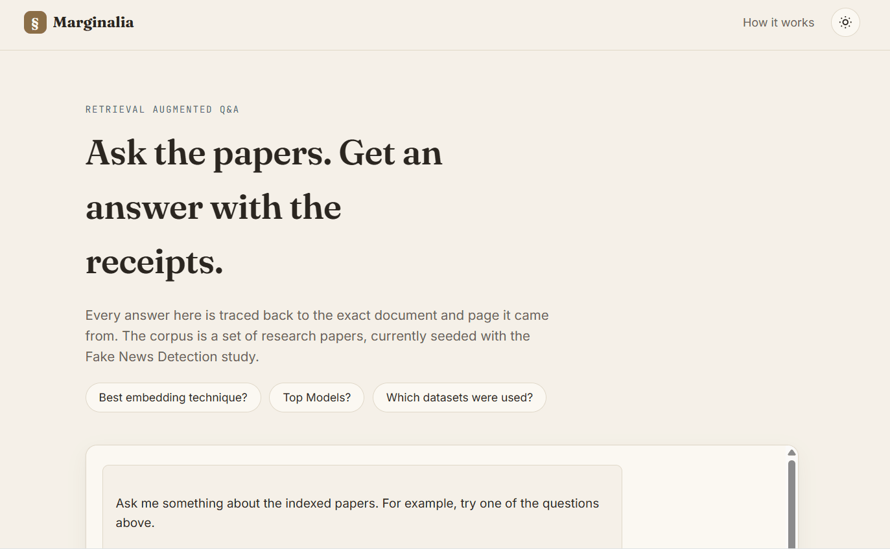

# Marginalia | RAG Chatbot for Research Papers


Ask questions about a corpus of research papers and get grounded answers with page-level citations. Built with LangChain, Chroma, local HuggingFace embeddings, and Gemini, deployed with a FastAPI backend on Hugging Face Spaces and a static frontend on Vercel.

**Live demo:** https://research-paper-rag-chatbot.vercel.app



## What it does

Marginalia ingests a folder of research PDFs, indexes them into a vector store, and answers natural-language questions about them, returning both a grounded answer and the exact source documents/pages it drew from, so you can verify every claim.

## Architecture

```
PDFs (eg_dir/)
   │
   ▼
Chunking (RecursiveCharacterTextSplitter)
   │
   ▼
Local embeddings (BAAI/bge-small-en-v1.5 via HuggingFaceEmbeddings)
   │
   ▼
Chroma vector store (persisted to disk)
   │
   ▼
Per-document MMR retrieval  ──┐
   │                          │
   ▼                          ▼
Context assembly       Source metadata (filename + page)
   │                          │
   ▼                          │
Gemini/DeepSeek (generation)  │
   │                          ▼
   └──────────► Final answer + grouped citations
```

## Engineering decisions

* **Local embeddings, not API-based** : uses `HuggingFaceEmbeddings` (BGE) instead of a hosted embedding API, avoiding rate limits and per-call cost during indexing.
* **Persisted vector store** : Chroma is only built once on first run; subsequent runs load the existing store instead of re-embedding the whole corpus from scratch.
* **Per-document retrieval** : plain top-k similarity search let one dominant paper crowd out others in multi-paper comparison queries. Retrieval now samples fairly across every source document so comparative questions ("what's the best technique across these articles?") actually draw from all of them.
* **Grouped source citations** : every answer returns filenames and page numbers, deduplicated and grouped per document, instead of a flat list of chunks.
* **Deployed on Hugging Face Spaces, not a general PaaS** : the initial deploy hit a free-tier memory ceiling running local embedding models on Render; moved to Hugging Face Spaces, which is built for exactly this kind of ML workload.
* **Cloud model flexibility:** The architecture enables seamless switching between the cloud-based Gemini API and DeepSeek-V4-Flash for text generation when the primary model reaches its usage limit.

## Tech stack

* **Orchestration:** LangChain (LCEL / Runnables)
* **Vector store:** Chroma
* **Embeddings:** HuggingFace `BAAI/bge-small-en-v1.5`
* **Generation:** Google Gemini 2.5 Flash / DeepSeek-V4-Flash
* **Backend:** FastAPI
* **Frontend:** Vanilla HTML / CSS / JavaScript
* **Deployment:** Hugging Face Spaces (backend, Docker), Vercel (frontend)

## Project structure

```
project/
├── backend/
│   ├── main.py              # FastAPI app exposing /ask and /health
│   ├── rag_pipeline.py      # ingestion, retrieval, and generation chain
│   ├── requirements.txt
│   └── .env.example         # template for required environment variables
└── frontend/
    ├── index.html
    ├── css/style.css
    └── js/app.js
```

## Running it locally

**Backend:**

```bash
cd backend
python -m venv venv
venv\Scripts\activate        # on Windows
# source venv/bin/activate   # on macOS/Linux

pip install -r requirements.txt
```

Create a `.env` file in `backend/` based on `.env.example`:

```
GOOGLE_API_KEY=your_gemini_api_key_here
HF_TOKEN=your_huggingface_token_here
```

Add your PDF corpus to `backend/eg_dir/`, then run:

```bash
uvicorn main:app --reload
```

The API will be available at `http://localhost:8000`, with interactive docs at `http://localhost:8000/docs`.

**Frontend:**
Open `frontend/index.html` directly in a browser, or serve it with any static server. Update `API_URL` in `frontend/js/app.js` to point at your local backend (`http://localhost:8000/ask`) for local testing.

## Notes

* **CORS**: locked to the deployed frontend's exact domain in production (`main.py`). For local development, temporarily widen `allow_origins` if needed.
* **First request after inactivity** may be slow as the free-tier Hugging Face Space spins down when idle and takes a short time to wake up.

## Author

Built by [Mohsin Hassan](https://github.com/MohsinHassan-8) | CS graduate, GenAI/LLM engineer.

\---

